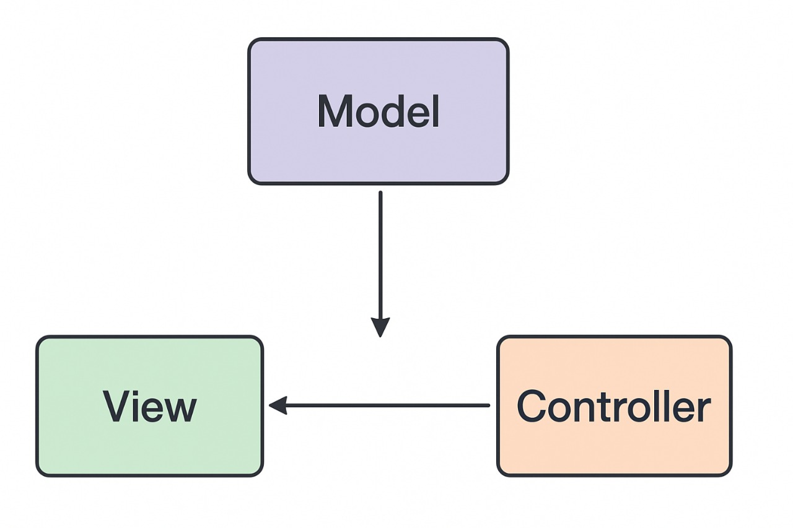

# Laporan Modul 1: Perkenalan Laravel
**Mata Kuliah:** Workshop Web Lanjut   
**Nama:** [Ayu Amelia] 
**NIM:** [2024573010045]  
**Kelas:** [TI 2B]  

---

## Abstrak 
Laporan ini membahas pengenalan framework Laravel sebagai salah satu framework PHP modern. Tujuan dari laporan ini adalah memberikan pemahaman dasar mengenai konsep, komponen utama, serta manfaat penggunaan Laravel dalam pengembangan aplikasi web.

---

## 1. Pendahuluan
- Laravel adalah framework PHP open-source yang digunakan untuk membangun aplikasi web secara modern, cepat, dan terstruktur. Framework ini dikembangkan dengan tujuan memudahkan developer dalam mengelola kode, mengurangi kerumitan, serta mempercepat proses pengembangan aplikasi.
- Laravel adalah framework berbasis arsitektur MVC (Model-View-Controller) yang memisahkan logika, tampilan, dan data. Dengan pendekatan ini, pengembangan aplikasi menjadi lebih rapi dan mudah dipelihara.
- Menggunakan pola MVC untuk pemisahan kode.

Opinionated framework, yaitu sudah memiliki standar dan aturan bawaan yang jelas.

Memiliki banyak fitur bawaan seperti Eloquent ORM, Blade templating, Artisan CLI, serta sistem autentikasi.

Dokumentasi lengkap dan komunitas yang besar.
- Website perusahaan atau profil organisasi.

Aplikasi e-commerce atau marketplace.

Content Management System (CMS).

API backend untuk aplikasi mobile.

Aplikasi SaaS (Software as a Service).

---

## 2. Komponen Utama Laravel (ringkas)
Tuliskan penjelasan singkat (1–3 kalimat) untuk tiap komponen berikut:
- Blade (templating)Template engine untuk membuat tampilan web dengan sintaks sederhana.
- Eloquent (ORM)Fitur untuk mengelola database lewat model berbasis objek.
- Routing Menentukan URL dan aksi apa yang dijalankan.
- Controllers Mengatur logika aplikasi antara model dan view.
- Migrations & Seeders Migration untuk struktur database, seeder untuk data awal.
- Artisan CLI Command line untuk otomatisasi perintah Laravel.
- Testing (PHPUnit)Alat pengujian aplikasi agar bebas error
(Tambahkan komponen lain jika ingin)

---

## 3. Berikan penjelasan untuk setiap folder dan files yang ada didalam struktur sebuah project laravel.
-app/ → Berisi kode utama aplikasi (model, controller, middleware).
-bootstrap/ → File inisialisasi dan autoload Laravel.
-config/ → Menyimpan file konfigurasi (database, mail, dll.).
-database/ → File migration, seeder, dan factory.
-public/ → Akses publik (index.php, asset CSS/JS).
-resources/ → View Blade, file bahasa, dan asset front-end.
-routes/ → Definisi rute (web.php, api.php, dll.).
-storage/ → Cache, log, dan file sementara.
-tests/ → File pengujian aplikasi.
-vendor/ → Library eksternal hasil install Composer.
---

## 4. Diagram MVC dan Cara kerjanya

- Model

Peran: Menangani data, logika bisnis, dan aturan aplikasi.

Contoh: Database, struktur data, logika seperti perhitungan harga total, dll.

Di Gambar: Model mengirim data ke View.

- View

Peran: Menampilkan antarmuka pengguna (UI).

Tugas: Menampilkan data dari Model dan memperbarui tampilan berdasarkan perubahan data.

Contoh: Halaman HTML, antarmuka aplikasi, dll.

Di Gambar: Menerima data dari Model dan perintah dari Controller

-Controller

Peran: Menangani input pengguna dan menghubungkan View dengan Model.

Tugas: Menerima input dari user (misalnya klik tombol), memprosesnya (jika perlu), dan meminta Model untuk diperbarui.

Contoh: Saat user klik tombol “Simpan”, Controller akan menyuruh Model menyimpan data.

Di Gambar: Mengontrol View dan mengatur Model secara tidak langsung.
---

## 6. Kelebihan & Kekurangan (refleksi singkat)
- Kelebihan Laravel menurut Anda
 Sintaks sederhana dan mudah dibaca.

Fitur bawaan lengkap (routing, ORM, templating, autentikasi).

Dokumentasi jelas dan komunitas besar.
- Hal yang mungkin menjadi tantangan bagi pemula
Membutuhkan pemahaman dasar PHP dan konsep MVC.

Struktur proyek cukup kompleks untuk yang baru belajar.

Banyak fitur sehingga butuh waktu untuk menguasainya.

---

## 7. Referensi
Cantumkan sumber yang Anda baca (buku, artikel, dokumentasi) — minimal 2 sumber. Gunakan format sederhana (judul — URL).
Dokumentasi Resmi Laravel — https://laravel.com/docs

Tutorial Laravel Dasar (Petani Kode) — https://www.petanikode.com/laravel

---